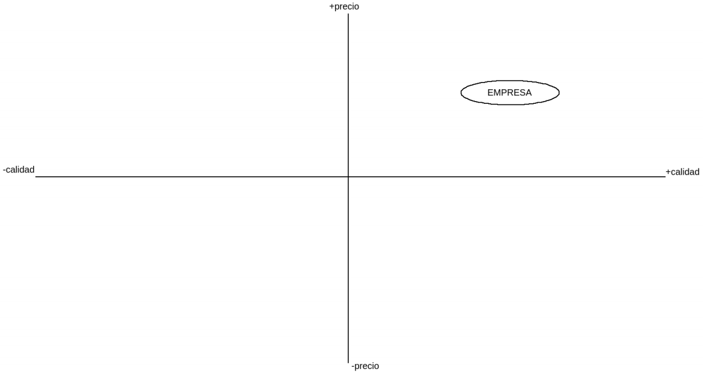

# Plan de empresa Cristian Quintero

**Indice.**
<!-- TOC -->
- [Plan de empresa Cristian Quintero](#plan-de-empresa-cristian-quintero)
- [1. La idea de negocio. Presentación del proyecto y del emprendedor](#1-la-idea-de-negocio-presentación-del-proyecto-y-del-emprendedor)
  - [1.1. La idea de negocio. Propuesta de valor y objetivo](#11-la-idea-de-negocio-propuesta-de-valor-y-objetivo)
  - [1.2. El emprendedor](#12-el-emprendedor)
    - [1.2.1. Interés en el proyecto](#121-interés-en-el-proyecto)
    - [1.2.2. Capacidad emprendedora](#122-capacidad-emprendedora)
- [2. Forma jurídica](#2-forma-jurídica)
  - [2.1. Forma jurídica utilizada y motivos por los que se ha elegido](#21-forma-jurídica-utilizada-y-motivos-por-los-que-se-ha-elegido)
  - [2.2. Trámites y plazos para la puesta en marcha de la empresa](#22-trámites-y-plazos-para-la-puesta-en-marcha-de-la-empresa)
- [3. El entorno y la competencia](#3-el-entorno-y-la-competencia)
  - [3.1. El entorno general](#31-el-entorno-general)
  - [3.2. El entorno específico](#32-el-entorno-específico)
  - [3.3. La competencia](#33-la-competencia)
  - [3.4. Análisis DAFO y estrategia CAME](#34-análisis-dafo-y-estrategia-came)
  - [3.5. La localización de la empresa](#35-la-localización-de-la-empresa)
  - [3.6. Cultura empresarial: misión, visión y valores](#36-cultura-empresarial-misión-visión-y-valores)
  - [3.7. Responsabilidad Social Corporativa](#37-responsabilidad-social-corporativa)
- [4. El mercado y los clientes](#4-el-mercado-y-los-clientes)
  - [4.1. Tipo de mercado](#41-tipo-de-mercado)
  - [4.2. Segmentación del mercado](#42-segmentación-del-mercado)
- [5. Plan de Marketing](#5-plan-de-marketing)
  - [5.1. Estrategia de posicionamiento](#51-estrategia-de-posicionamiento)
  - [5.2. Estrategia de producto](#52-estrategia-de-producto)
  - [5.3. Estrategia de precio](#53-estrategia-de-precio)
  - [5.4. Estrategia de promoción](#54-estrategia-de-promoción)
  - [5.5. Estrategia de distribución](#55-estrategia-de-distribución)
  - [5.6. Atención al cliente](#56-atención-al-cliente)
- [6. Recursos Humanos](#6-recursos-humanos)
  - [6.1. Dirección y liderazgo](#61-dirección-y-liderazgo)
  - [6.2. Plan de motivación laboral](#62-plan-de-motivación-laboral)
  - [6.3. Organigrama y selección de personal](#63-organigrama-y-selección-de-personal)
  - [6.4. Obligaciones laborales](#64-obligaciones-laborales)
    - [6.4.1. Contratos a realizar y duración](#641-contratos-a-realizar-y-duración)
    - [6.4.2. Convenio colectivo aplicable al sector](#642-convenio-colectivo-aplicable-al-sector)
    - [6.4.3. Organización en prevención de riesgos](#643-organización-en-prevención-de-riesgos)
- [7. Plan de Producción](#7-plan-de-producción)
  - [7.1. Análisis de costes](#71-análisis-de-costes)
- [8. Inversión y financiación](#8-inversión-y-financiación)
  - [8.1. Inversiones y gastos iniciales](#81-inversiones-y-gastos-iniciales)
  - [8.2. Financiación propia](#82-financiación-propia)
  - [8.3. Financiación ajena](#83-financiación-ajena)

# 1. La idea de negocio. Presentación del proyecto y del emprendedor

## 1.1. La idea de negocio. Propuesta de valor y objetivo

Mi idea de negocio trata sobre una empresa que se dedicará a la **creación / mantenimiento de paginas webs** tanto para pequeños, medianos y grandes comercios / empresas, cubriendo la necesidad de llevar los productos / servicios mas allá de la localidad donde estén.

La propuesta de valor consiste en páginas que a la vez de **funcionar bien, sea atractiva para el público al que vaya dirigido el producto / servicio**, pudiendo recurrir a **tarifas mensuales / anuales** para el **mantenimiento** de la misma, el punto fuerte es el **precio**, cuanto **mayor** sea la empresa, **mejor** será la pagina y en consecuencia el precio de la creación será **mayor**, el precio del mantenimiento **será el mismo** para todos.

El objetivo a **corto plazo** es hacer **campañas de marketing** y dar **buen servicio** para que a su vez el boca a boca haga efecto y así conseguir los **primeros clientes**, bien sea para solo la **creación** de la pagina o el **mantenimiento** de la misma, o las **dos cosas**. 

El nombre elegido para la empresa sería **CREMAWEBS**, ya que es un nombre corto, fácil de recordar y atractivo para el sector.

## 1.2. El emprendedor

El emprendedor principal sería Cristian Quintero García, con posibilidad de buscar más socios / empleados para el proyecto.
Hasta ahora seriamos 3 socios principales.

### 1.2.1. Interés en el proyecto

El interés por este proyecto es alto, aquí los motivos:

- Por experiencia durante el curso, el sector me está gustando bastante, lo que más la parte de cliente, que es a la que va enfocada este plan de empresa.
- Hay probabilidad de que el proyecto lo inicie con algún compañero de clase con el que me llevo muy bien, en consecuencia el ambiente laboral va a ser muy favorable.
- Dentro de las empresas que crean paginas webs o las mantiene, muchas de ellas tienen un precio muy elevado y dan un servicio pésimo, lo cual de ahí la oportunidad de hacerse hueco en el sector.
- Hay subvenciones y ayudas que las podría aprovechar para iniciar el proyecto, con lo cual es otro punto a favor.

### 1.2.2. Capacidad emprendedora

Respecto a la capacidad emprendedora mis motivos personales son los
siguientes:

- Quisiera ser mi propio jefe, tomar decisiones, gestionar una
empresa.
- Me gustaría entrar en el sector y dar un bien para la sociedad.

Factores para la motivación emprendedora:

- Dispongo de la tecnología necesaria.
- No tengo muchos conocimientos sobre la gestión y administración de empresas, pero tendría socios que sí dispondrían de esos conocimientos.
- En este momento no tengo responsabilidades, con lo cual nada que perder.
- No tengo experiencia sobre el sector, pero si muchas ganas y actitud, ademas si tuviera que trabajar en el sector antes de iniciar la empresa, estaría dispuesto.

Factores para que el trabajo fluya:

- Capacidad de trabajar en grupo.
- Habilidades sociales para tener el don de gentes.
- Creatividad y se asumir riesgos.
- Capacidad de cumplir objetivos en un tiempo determinado con un grupo de trabajo.

# 2. Forma jurídica

## 2.1. Forma jurídica utilizada y motivos por los que se ha elegido

La mejor forma jurídica que mas se adapta a nuestras necesidades sería Sociedad Limitada Nueva Empresa, los motivos son los siguientes:

- Sus beneficios fiscales (aplazamiento del impuesto de sociedades en 2 años).
- Responsabilidad limitada a lo aportado por cada socio.
- Es la sociedad que menos tarda en constituirse, ademas se puede constituir de forma telemática.

En principio seremos 3 socios y cada uno aportaremos 1.000€ para constituirla.

## 2.2. Trámites y plazos para la puesta en marcha de la empresa

Los tramites necesarios para la puesta en marcha de la empresa son los siguientes:

- Certificación negativa del nombre, donde se indicaran 5 posibles nombres y el plazo es de 510 días.
- Abrir la cuenta bancaria para la sociedad, con los 3000€ aportados.
- Estatutos de la sociedad.
- Escritura publica ante un notario.
- Pago de impuestos en la consejería de economía, en concreto el impuesto de transmisiones patrimoniales y patrimonio.
- Solicitud del CIF.
- Registrar la sociedad en el registro mercantil.

Se acudirá a un PAE, en concreto al siguiente:
ASESORLEX: SANLÚCAR DE BARRAMEDA: IRENE GRAO
**Dirección** → Calle Cibeles no 18, SANLÚCAR DE BARRAMEDA, CÁDIZ
**Teléfono** → 601644153
**Horario** → 9:00/21:00
**Tipo** → Privado
**Web** → https://creatiogestiones.com
**Correo Electrónico** → info@creatiogestiones.com

El inicio de la actividad está provisto para cuando acaben las prácticas, que sería en Junio del 2021, con lo cual un mes antes se harían las solicitudes.

# 3. El entorno y la competencia

## 3.1. El entorno general

Dentro del análisis del entorno general, lo más importante es el análisis PEST, lo cual tendremos en cuenta lo siguiente:

- Actualmente sufrimos una crisis sanitaria y económica, no obstante hay ayudas y subvenciones para empresas, además en este sector está la ventaja del teletrabajo, lo cual no se ve muy afectado.
- Es un sector en continua evolución, con lo cual cada día van saliendo nuevas tecnologías y hay que estar en continuo aprendizaje.
- Los gustos de cada cliente puede ser muy variado, también su público objetivo y tipo de producto / servicio.

Con todo esto, sacamos las conclusiones:

- Es un entorno en continua evolución, lo que conlleva cambios a los que adaptarse, lo que quiere decir que es un entorno cambiante.
- En este proyecto solo se necesita constituir la empresa y ir adaptándose a las nuevas tecnologías, con lo cual el entorno es complejo.
- La empresa ofrece un servicio que realmente tiene una gran amplitud de mercado ya que podemos tener clientes de diferentes zonas geográficas de todo el mundo, lo cual lo hace un entorno poco integrado.
- En este sector hay bastante competencia, aunque es un sector en crecimiento, las nuevas tecnologías sirven para todas las empresas, es un entorno hostil.

## 3.2. El entorno específico

Análisis de las 5 fuerzas de porter:

- La rivalidad interna es alta, por que hay muchas empresas en el entorno, ademas todas ofrecen un servicio muy parecido, solo se pueden diferenciar unas de otras en precio y calidad.
- Respecto la posibilidad de que nuevos competidores entren es muy posible, ya que no se necesita una gran inversión, pero si hay que distinguir el servicio de los demás competidores, ya que no hay mucha diferencia.
- Los servicios sustitutivos podrían ser cursos online de creación de webs, algún tutorial de mantenimiento de paginas webs, pero si no se tiene el conocimiento, suena a chino.
- El nivel de poder de negociación de los proveedores en este sector es bajo, ya que hay muchos proveedores.
- El nivel de poder de negociación de los clientes también es bajo, ya que hay muchos clientes con la misma necesidad.

## 3.3. La competencia

Aquí trataremos a la competencia directa.

En este caso, hay un numero enorme de competidores repartidos por todo el mundo, que ofrecen el mismo servicio a los clientes.

Sobre el precio de la creación de webs, oscila entre 250 - 1500 euros, dependiendo de la calidad de pagina que se desee, en cuanto a mantenimiento de una web, oscila entre los 50 - 300 euros el mes.

La mayoría de empresas no tienen un servicio postventa bueno, con lo que el nivel de satisfacción de los clientes viene dado con que le guste la pagina a su vista y este bien enfocado a su publico, no obstante después de un tiempo prudencial, pueden no estar satisfecho por el servicio postventa ya que pueden surgir problemas.

Respecto al marketing, estas empresas suelen publicitarse a través de anuncios en Internet, pagando por posicionamiento en google respecto a las búsquedas de los usuarios, vallas publicitarias, por la radio.. los medios normalmente utilizados o simplemente por el boca a boca de clientes satisfechos.

La estrategia que siguen es una estrategia de mercado inestable ya que hay mucha competencia, aunque la tecnología suele llegar cuando ya están probadas que funcionan.

Como es un mercado en auge y continuamente se va actualizando, la diferencia entre cosas bien hechas o mal hechas es clara, una pagina que tarda mucho en cargar esta mal optimizada, si una pagina no se va actualizando se va a quedar obsoleta en poco tiempo.. y cosas por el estilo, aunque como decíamos antes, lo peor de algunas de ellas es el servicio postventa que le hacen perder clientes y deterioran la propuesta de valor, algo que quizas hagan bien es que ya están dentro del sector y conocen los clientes.

## 3.4. Análisis DAFO y estrategia CAME

**Debilidades:**

- Poca experiencia en el sector.
- Poco capital inicial.

**Amenazas:**

- Entorno cambiante.
- Mucha competencia potencial.
- Crisis sanitaria y económica.

**Fortalezas:**

- Buen nivel de formación.
- Buen servicio calidad / precio ofrecido.
- Servicio postventa excelente.
- Conocimientos sobre la gestión empresarial.
- Disposición de la tecnología necesaria.
- Excelente ambiente laboral.

**Oportunidades:**

- Mercado en auge.
- Muchos negocios por el COVID19 quieren disponer de una pagina web.
- Podría aprovechar la situación mundial para adaptar mi publicidad y hacerla atractiva.

**Corregir:**

- Para corregir las debilidades, se harán campañas de marketing utilizaremos redes sociales para darnos a conocer e ir creando una comunidad y dar un muy buen servicio calidad / precio y postventa para así incrementar el boca a boca de nuestros primeros clientes.

**Afrontar:**

- Para afrontar las amenazas tendremos siempre en cuenta a los clientes, sus gustos, preferencias, clientes objetivos, también iremos actualizando a la tecnología mas innovadora y que mejor funcione.

**Mantener:**

- Para mantener las fortalezas se harán reuniones en equipo, se mantendrá una buena calidad laboral y se mantendrá a los trabajadores actualizados con los cursos y formaciones necesarias.

**Explotar:**

- Para explotar las oportunidades, se harán estudios en el mercado para saber que ofreces, por que tecnologías apostar, y donde iniciar campañas publicitarias.

## 3.5. La localización de la empresa

La empresa se instalara en Sanlucar de Barrameda.

En un principio , la sede sera desde casa, ya que solo necesitamos un ordenador y conexión a internet.

Respecto al acceso a la empresa, no es algo importante ya que tan solo habría que comunicarse con los clientes por llamada telefónica o directamente a través de la web, por chat / coreo.

La demanda es alta, ya que hay muchos comercios que quieren dar el paso a que sus productos / servicios no se queden solo en Sanlucar, que lleguen mas lejos, aunque también hay mucha competencia.

Tenemos las ayudas para el inicio de la actividad para emprendedores jóvenes y tendríamos algunos beneficios fiscales ya comentados anteriormente, ademas podríamos tirar de alumnos en practicas del grado superior de DAW que esta en Sanlucar.

Un tema muy importante también seria el co-working, ya que colaborando con empresas del sector a parte de estudiar sus métodos de competencia, se aprende y aportamos beneficiosamente a la sociedad.

## 3.6. Cultura empresarial: misión, visión y valores

La **misión** es a los negocios que no tienen una pagina web a estas alturas, que todo negocio prácticamente tiene una web, crearla y ir manteniendo el máximo numero posibles de webs, también una web que ya este creada y se haya quedado obsoleta o no haya terminado de gustar o simplemente quieren actualizarla, estar nosotros manteniendola, actualizándola o arreglando los problemas.

La **visión** de la empresa es ser líder en la zona e ir creciendo cada vez mas a la vez de ir haciendo el bien comunitario de que toda empresa tenga el gran mundo abierto de tener una web y llegar mas lejos a la par que crecer.

Los **valores** de la empresa es tener buenas condiciones y salarios dignos a los trabajadores y respecto a los clientes orientarlos correctamente, aparte de tener en consideración el medio ambiente y así tener un mundo mejor para todos.

La cultura se transmitirá a través de una imagen corporativa, la cual sera determinada por lo siguiente:

- Siempre iremos actualizando conocimientos para ofrecer el mejor servicio.
- El boca a boca sera algo muy importante y cuidado por nosotros.
- Se crearan / participaremos en movimientos sociales a favor de la tecnología.
- Las campañas de marketing se realizaran por zonas y si se puede con un significado.

## 3.7. Responsabilidad Social Corporativa

Las acciones respecto a la Responsabilidad Social Corporativa son las siguientes:

- Se llevara a cabo el modelo de las tres erres: Reducir, Reutilizar y Reciclar.
- Utilizaremos equipamientos ergonómicos y beneficiosos para la salud, como hay que estar mucho tiempo sentado mirando a la pantalla cada cierto tiempo habra que levantarse a estirar y tener buena claridad y hábitos saludables.
- No se discriminara a nadie por ningún sexo o religión.
- Se participara en eventos tecnológicos, no tecnológicos, de ayuda a los necesitados, charlas, etc.

# 4. El mercado y los clientes

## 4.1. Tipo de mercado

La cuota del mercado en las empresas de IT's esta muy repartida entre todas las empresas, pero como esta en continuo crecimiento, hay hueco para hacerse con un mínimo de cuota.

El mercado a finales del año pasado facturo un total de 100.000 millones de euros, siendo puntero en el PIB nacional.

Consta de una sencilla estructura la cual la empresa ofrece el servicio y el consumidor obtiene ese servicio, no existe el intermediario ni prescriptor ninguno.

El precio en el cual estaría el punto de equilibrio seria de unos 1500 euros.

En este proyecto, aspiramos a al menos aproximadamente un 7% de la cuota de mercado en el primer año de actividad.

Respecto a nuestra empresa, podemos ver que se trata de un mercado de competencia monopolistica, ya que el servicio es similar al de otras empresas, por lo cual le damos mas importancia a la propuesta de valor distinguiéndonos por marca / imagen corporativa y dándole mucha importancia al cliente con el servicio y la postventa.

## 4.2. Segmentación del mercado

Con la segmentación de mercado tendremos en cuenta los siguientes factores:

- Geográficos, puesto que nuestros primeros clientes podrian venir de la zona donde estamos asentados, siendo esta la costa noroeste de Cadiz.
- Gustos de clientes, agruparemos por gustos comunes. 
- Empresa, agrupando por empresa nueva, o mas bien consolidada.

Por lo tanto tendremos 2 segmentos de clientes, por gusto y por empresa.

Nuestros primeros Early Adopters, estaran comprendidos en pequeñas empresas que quieran tener su propia pagina web.

# 5. Plan de Marketing

## 5.1. Estrategia de posicionamiento

La estrategia de posicionamiento elegida sera la de calidad, por lo que nos centraremos en la imagen corporativa, la marca y la atencion a los clientes.

El mapa de posicionamiento estratégico es el siguiente:

## 5.2. Estrategia de producto

Nuestro producto lo podemos dividir en tres *"subproductos"*:

- Producto básico *(La necesidad)* -> Cubrimos la necesidad de expansión del negocio.

- Producto formal *(Caracteristicas formales)* -> Lo unico que puede variar de un producto a otro es la calidad.

- Producto ampliado *(Ventajas adicionales)* -> El producto ampliado sería el mantenimiento y actualización de la misma pagina web.

## 5.3. Estrategia de precio

## 5.4. Estrategia de promoción

## 5.5. Estrategia de distribución

## 5.6. Atención al cliente

# 6. Recursos Humanos

## 6.1. Dirección y liderazgo

## 6.2. Plan de motivación laboral

## 6.3. Organigrama y selección de personal

## 6.4. Obligaciones laborales

### 6.4.1. Contratos a realizar y duración

### 6.4.2. Convenio colectivo aplicable al sector

### 6.4.3. Organización en prevención de riesgos

# 7. Plan de Producción

## 7.1. Análisis de costes

# 8. Inversión y financiación

## 8.1. Inversiones y gastos iniciales

## 8.2. Financiación propia

## 8.3. Financiación ajena
