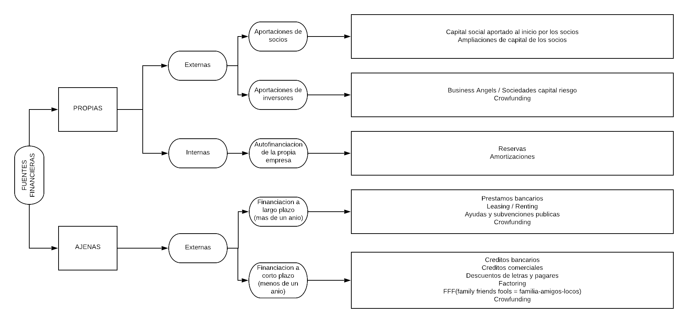

# 1. Resumen Tema 7.3 y 8

## 1.1. Contenido
<!-- TOC -->
- [1. Resumen Tema 7.3 y 8](#1-resumen-tema-73-y-8)
  - [1.1. Contenido](#11-contenido)
  - [1.2. Analisis de costes](#12-analisis-de-costes)
    - [1.2.1. A) Umbral de rentabilidad (o punto muerto)](#121-a-umbral-de-rentabilidad-o-punto-muerto)
    - [1.2.2. B) Calculo de beneficios y precios de venta a partir de costes](#122-b-calculo-de-beneficios-y-precios-de-venta-a-partir-de-costes)
  - [1.3. La inversion y los gastos iniciales](#13-la-inversion-y-los-gastos-iniciales)
    - [1.3.1. A) Las inversiones](#131-a-las-inversiones)
    - [1.3.2. A) Gastos iniciales](#132-a-gastos-iniciales)
  - [1.4. La financiacion de la empresa](#14-la-financiacion-de-la-empresa)
  - [1.5. Fuentes de financiacion propias](#15-fuentes-de-financiacion-propias)
    - [1.5.1. A) Aportaciones de los socios](#151-a-aportaciones-de-los-socios)
    - [1.5.2. B) Inversores](#152-b-inversores)
      - [1.5.2.1. B1) Business angels](#1521-b1-business-angels)
      - [1.5.2.2. B2) Sociedades de Capital de Riesgo](#1522-b2-sociedades-de-capital-de-riesgo)
    - [1.5.3. C) Autofinanciacion](#153-c-autofinanciacion)
  - [1.6. Fuentes de financiacion ajenas](#16-fuentes-de-financiacion-ajenas)
    - [1.6.1. A) El prestamo bancario](#161-a-el-prestamo-bancario)
    - [1.6.2. B) El credito bancario](#162-b-el-credito-bancario)
## 1.2. Analisis de costes

**Costes fijos:** No dependen del nivel de actividad de la empresa, son una cantidad fija independiente de la produccion.
**Ejemplos:**

- Alquiler de local, seguros de local, gastos limpieza.
- Gastos de luz, agua, telefono e internet. *(Siempre que no tengan que ver con la produccion)*
- Gasto en publicidad y promocion del producto.
- Material de oficina y gastos en comunicaciones.

**Costes variables:** Dependen del nivel de actividad de la empresa, cuanto mas se fabrica/vende mas costes variables.
**Ejemplos:**

- Compra de mercancias o materias primas necesarias.
- Gasto en herramientas y utensilios necesarios para la produccion.
- Transporte de los productos al punto de venta.

### 1.2.1. A) Umbral de rentabilidad (o punto muerto)

**Umbral de rentabilidad:** Nivel de ventas a partir del cual se empiezan a obtener beneficios, o nivel de ventas con el cual se cubren los gastos y el beneficio es 0.

**Calcular el umbral de rentabilidad:**
Los ingresos totales son: IT = precio x cantidad que vendemos. `IT = P x Q`
Los costes totales de son la suma de costes fijos y costes variables. `CT = CF + CVU x Q`
Al igualar IT = CT para calcular el umbral de rentabilidad tendremos: `P x Q = CF + CVU x Q`
Si despejamos la Q, tenemos la siguiente formula: `Q* = CF/(P - CVU)`

### 1.2.2. B) Calculo de beneficios y precios de venta a partir de costes

**Beneficios**
Beneficio = ingresos totales - costes totales.
`B = IT - CT`
O lo que es lo mismo
`B = (P x Q) - (CF + CVU x Q)`

**Precio de venta**
Tenemos 2 precios de venta:

- Precio tecnico.
- Precio de venta.

**Precio tecnico**
Es aquel precio que permite cubrir todos los costes, tanto fijos como variables.
`Pt = CT/Q`

**Precio de venta**
Es el precio que obtenemos sumando al precio tecnico, el margen que queremos ganar.
`PV = Pt x (1 + margen)`

## 1.3. La inversion y los gastos iniciales

**Inversion:** Es la compra de un bien o un derecho que es duradero eb la empresa y que va a usarse durante mas de un año.
**Gasto:** Es la compra de un bien, de un servicio o de un derecho, que la empresa va a consumir de forma inmediata.

### 1.3.1. A) Las inversiones

| INVERSIONES |
|-------------|
| Local |
| Instalaciones |
| Mobiliario |
| Maquinaria |
| Herramientas y utiles |
| Vehiculos |
| Equipos informaticos |
| Programas informaticos |
| Patentes, marcas |

### 1.3.2. A) Gastos iniciales

| GASTOS INICIALES |
|------------------|
| Gastos de contribucion |
| Gastos de lanzamiento |
| Alquiler de locales |
| Sueldos y seguridad social |
| Suministros |
| Servicios profesionales |
| Material de oficina |
| Stock minimo a la venta |
| Gastos financieros |

## 1.4. La financiacion de la empresa

**Financiacion:** Es la obtenciond e recursos economicos para hacer frente a las inversiones y gastos de empresa. *(Hace referencia a de donde obvtengo el dinero para poder pagar las inversiones y los gatos que requiere la empresa)*

## 1.5. Fuentes de financiacion propias

Son los recursos "propios" con que cuenta la empresa y que por tanto no hay que devolver a nadie, se califican en:

- **Externas:**
    Aquellas que siendo propiedad de la empresa han sido aportadas por los socios o por inversores.
- **Internas o autofinanciacion:**
    Aquellas que consigue la empresa a traves de su propia actividad.

### 1.5.1. A) Aportaciones de los socios

Las empresas se crean por que una o varias persionas llamadas **socios, aportan un capital inicial** para que comience la actividad. esta aportacion puede ser **en dinero o tambien en bienes**.
El capital puede sufrir variaciones, los socios pueden volver a aportar capital ***(ampliacion de capital)*** o incluso pueden **aparecer nuevos socios.**

### 1.5.2. B) Inversores

#### 1.5.2.1. B1) Business angels

**Business angels:** Son inversores individuales que **ofrecen capital, sus conocimientos tecnicos y su red de contacos** a pequeñas empresas que se encuentran en fase inicial.
Se diferencia del mero prestamista en que **ofrece al emprendedor** ademas del capital su **experiencia profesional, contactos y ayudas estrategicas**.

**Objetivo:** Obtener una plusvalia o rendimiento a medio plazo (3 a 5 años) al revender su aportacion.

**Tipos de empresas que financian:**

- Emprendedores que quieren **poner en marcha un proyecto** *(capital semilla)*.
- Empresas que se encuentran al **inicio de su actividad**, start-up *(capital de inicio)*.
- Empresas que tienen que **afrontar una fase de crecimiento** *(expansion de capital)*.

#### 1.5.2.2. B2) Sociedades de Capital de Riesgo

**Sociedades de Capital Riesgo:** Son empresas que **participan en el capital de otras empresas**, en la fase inicial o en empresas ya en funcionamiento que **tienen un gran potencial de crecimiento** y de rentabilidad **pero son un gran riesgo**.
Su diferencia con los business angels es que son empresas que realizan una **mayor aportacion de capital** y **asumen mucho mas riesgo**.

**Objetivo:** El objetivo es que **la empresa crezca y se consolide**, y en un plazo de 2 a 8 años vender su participacion y **obtener una plusvalia**.

### 1.5.3. C) Autofinanciacion

Es la financiacion que realiza la empresa **a traves de su propia actividad empresarial**, por la marcha del negocio.
**Hay dos tipos:**

- **Reservas:**
    Cuando la empresa **de sus beneficios, una parte se queda sin repartir y se mantiene en la empresa**.
- **Amortizaciones:**
    Es la **perdida de valor de un bien de inversion** *(+ 1 año)* por uso o por quedarse obsoleto. Esta perdida de valor se refleja como un **gasto en la empresa**, de manera que los socios se reparten menos beneficios y ese dinero queda en la empresa sin repartir.

## 1.6. Fuentes de financiacion ajenas

Son aquellas que **suponen una deuda** para la empresa ya que han de devolverse. Estas fuentes se clasifican en **largo plazo** *(+ 1 año)* o **corto plazo** *(- 1 año)*.

### 1.6.1. A) El prestamo bancario

Es una de las **fuentes mas utilizadas** para financiar **grandes cantidades de dinero** que deben **devolverse en varios años**.

**Caracteristicas:**

| CARACTERISTICAS |
|-----------------|
| Capital |
| Tipo de interes |
| Intereses del prestamo|
| Cuota |
| Comision de apertura y de estudio |
| T.A.E. |
| Comision de cancelacion o amortizacion anticipada |
| Plazo de devolucion |
| Avalista |
| Seguros de vida |

### 1.6.2. B) El credito bancario

Es **la puesta a disposicion de una cantidad de dinero** en una cuenta, de la cual la empresa **pagara intereses por las cantidades que vaya sacando de la cuenta**.
Sin embargo, suelen establecerse unos intereses por las cantidades utilizadas **y otro interes menor por la cantidad no utilizada**.
El **plazo suele ser entre 6 meses y 1 año**, por ello se considera financiacion **a corto plazo**.

**Diferencias entre prestamo y credito:**

| Prestamo | Credito |
|----------|---------|
| El importe total se entrega el primer dia. | Se pone a disposicion una cantidad, la cual podra utilizarse o no. |
| Se pagan iontereses por toda la cantidad del prestamo. | Se pagan intereses por la cantidad utilizada. Por la no utilizada se pagan intereses menores. |
| Es a largo plazo, entre 2 y 8 años | Es a corto plazo, entre 6 meses y 1 año, se puede pactar su renovacion. |
| Se utiliza para financiar inversiones o bienes de larga duracion. | Se utiliza para comprar las mercaderias que se van a vender o necesidades temporales de liquidez. |
